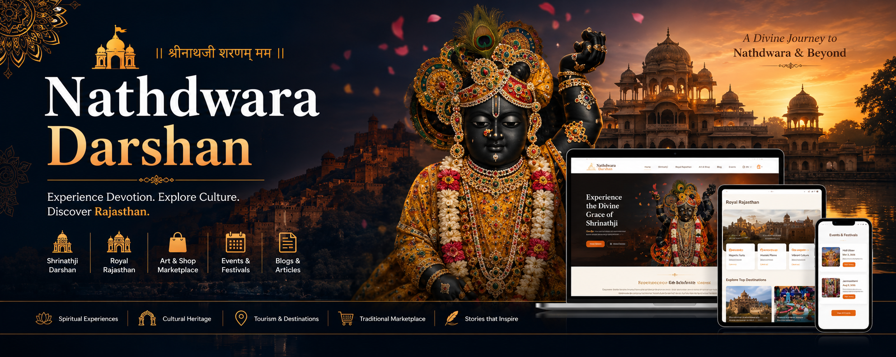
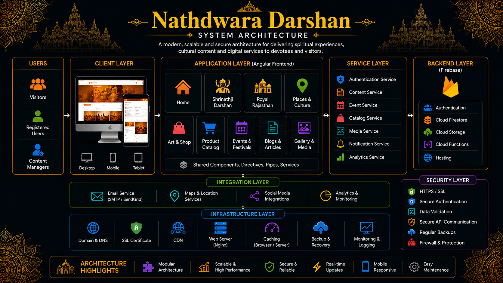
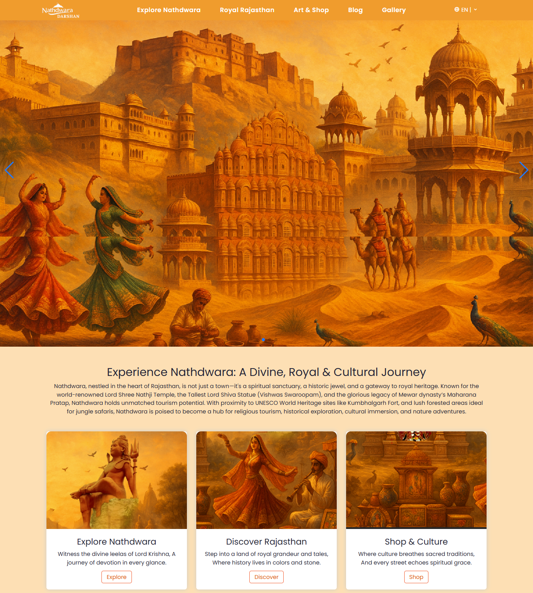
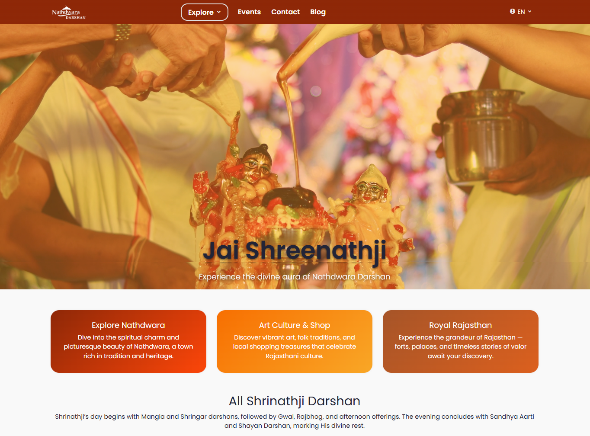
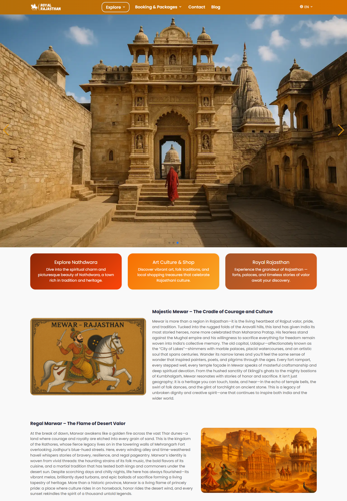
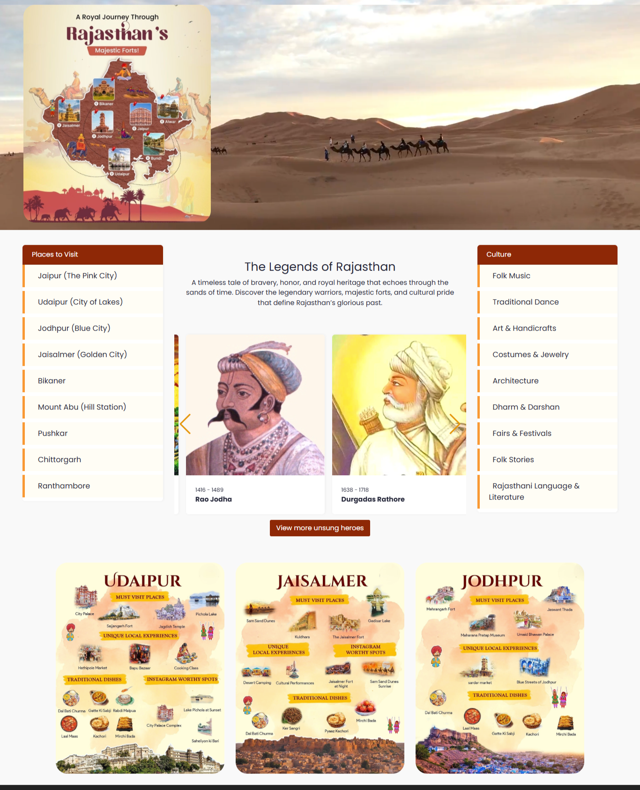
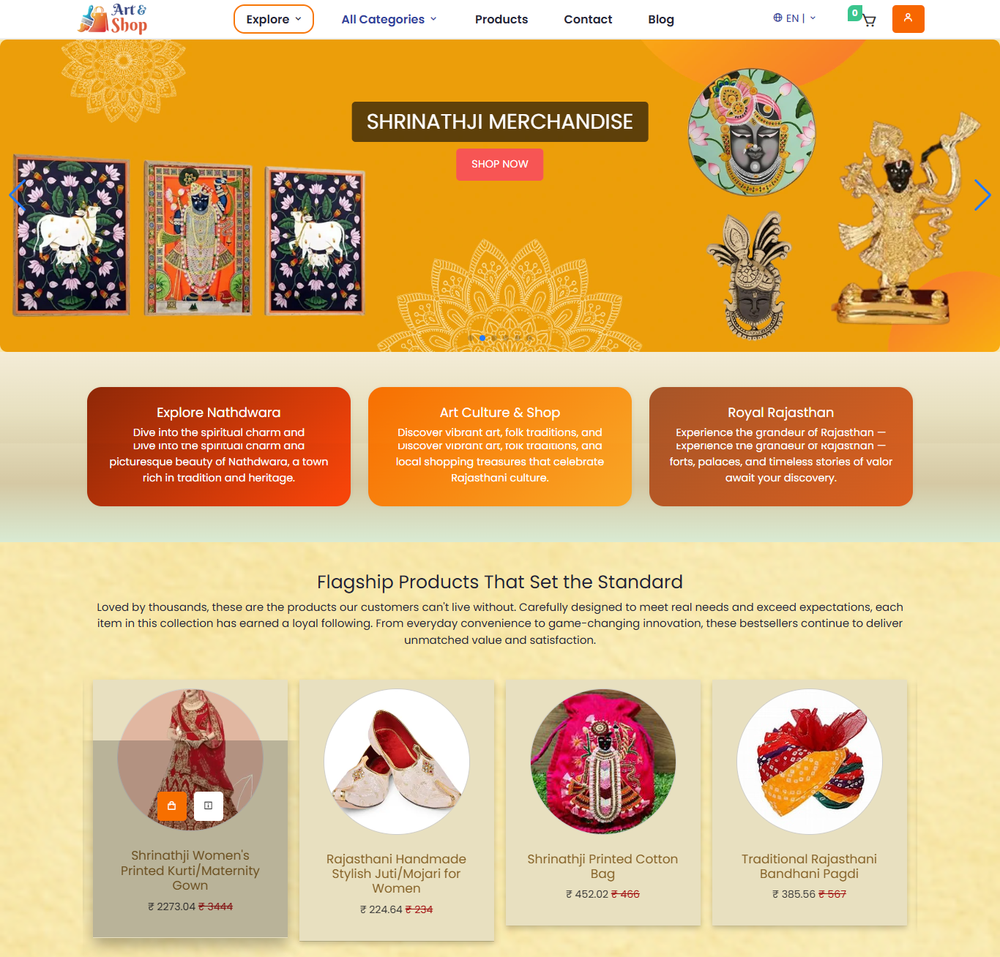
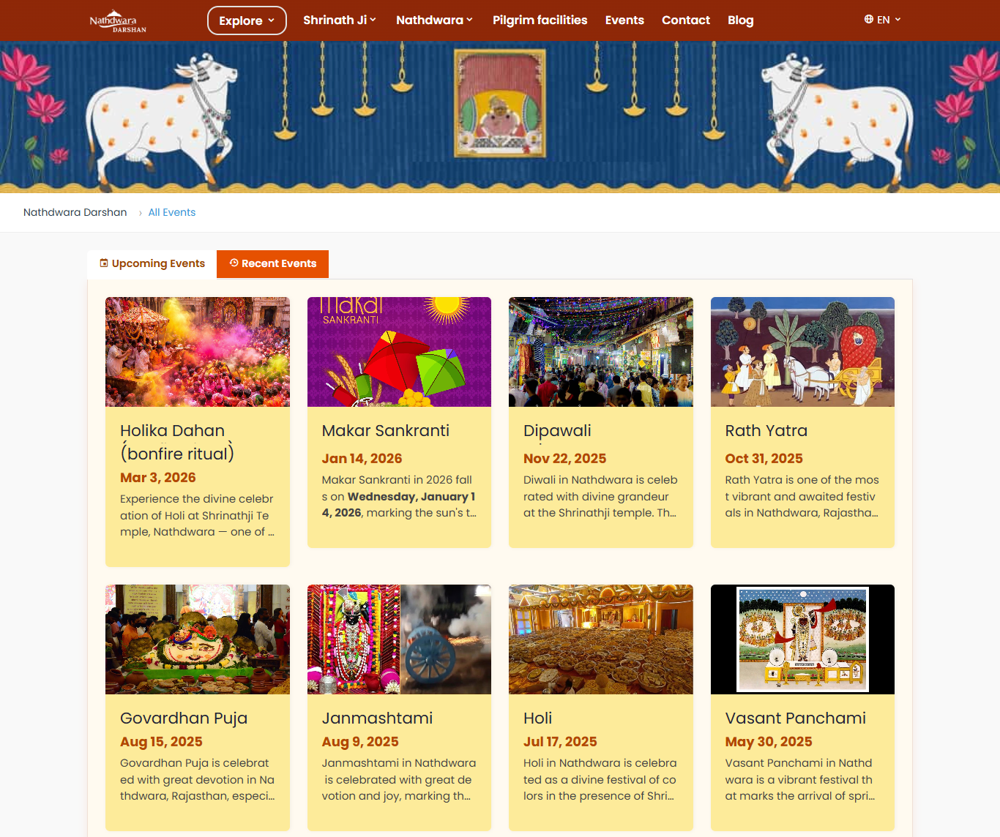
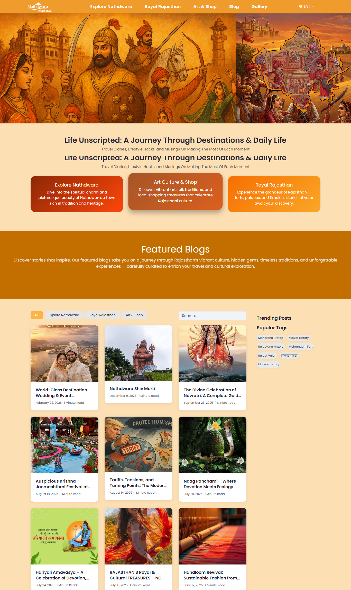

# 🙏 Nathdwara Digital Platform


Modern digital platform for Nathdwara Darshan designed to enhance devotee experiences, streamline daily operations, and provide seamless access to services and information.

<p align="center">
  
</p>

---

## 🌐 Live Platform

https://nathdwaradarshan.com/

---

## Platform Vision

Nathdwara Digital Platform is designed to provide a modern digital experience for devotees while simplifying operational activities through a centralized and easy-to-use platform.

The platform focuses on accessibility, engagement, digital convenience, and operational efficiency, helping users stay connected with daily activities and services.

---

## Platform Highlights

* Modern responsive user experience
* Daily darshan information and updates
* Spiritual and devotional content
* Rajasthan heritage and cultural discovery
* Historical places and destination guides
* Events and festival information
* Art & Shop marketplace experience
* Cultural blogs and storytelling
* Mobile-friendly platform experience
* Secure and scalable digital infrastructure

---

## Digital Experience Infrastructure

### Spiritual Experience

The platform provides:

* Daily darshan information
* Temple and devotional content
* Festival highlights and celebrations
* Spiritual storytelling experiences
* Accessible cultural information
* Responsive user experience

---

### Cultural & Tourism Experience

Visitors can:

* Explore Rajasthan heritage destinations
* Discover local culture and traditions
* Browse historical information
* Explore events and festivals
* Access curated travel content
* Experience immersive digital storytelling

---

## Platform Features

* Modern responsive architecture
* Spiritual and cultural content delivery
* Events and festival discovery
* Art & Shop marketplace experience
* Blog and editorial content platform
* Mobile-first user experience
* Scalable digital infrastructure
* Search and navigation experience
* Analytics and performance monitoring
* Optimized content accessibility

## Technology Stack

### Frontend Engineering

* Angular 19
* TypeScript 5
* RxJS
* Angular Router
* Tailwind CSS
* Angular Animations
* ngx-translate

### Backend Infrastructure

* Firebase
* Cloud Firestore
* Firebase Authentication
* Cloud Functions
* Firebase Hosting

### UI & Experience

* Responsive Design
* Mobile-First Architecture
* Interactive User Interfaces
* Optimized Content Delivery
* Modern Navigation Experience

### Architecture & Operations

* Modular Architecture
* Cloud Infrastructure
* Environment-Based Configuration
* Scalable Application Structure
* Performance Optimized Workflows

---

## 🏗️ System Architecture

<p align="center">
  
</p>

Nathdwara Darshan follows a modular Angular architecture designed to deliver spiritual experiences, cultural exploration, tourism information, digital content, and marketplace features through a unified platform.

### Architecture Layers

- **Client Layer**
  - Desktop
  - Tablet
  - Mobile Devices

- **Application Layer**
  - Home
  - Shrinathji Darshan
  - Royal Rajasthan
  - Art & Shop
  - Product Catalog
  - Events & Festivals
  - Blogs & Articles
  - Gallery & Media

- **Service Layer**
  - Authentication
  - Content Management
  - Event Management
  - Product Management
  - Media Services
  - Analytics

- **Backend Layer**
  - Firebase Authentication
  - Cloud Firestore
  - Cloud Storage
  - Cloud Functions
  - Hosting

- **Integration Layer**
  - Email Services
  - Maps & Location Services
  - Social Media Integrations
  - Analytics & Monitoring

- **Security Layer**
  - HTTPS / SSL
  - Secure Authentication
  - Secure API Communication
  - Data Validation
  - Backup & Recovery
---

## Platform Preview

The platform delivers a connected digital experience through modern interfaces, operational tools, administrative controls, and user-centric workflows.

---

## 📸 Platform Screenshots

### 🏠 Home Experience

<p align="center">
  
</p>

### 🙏 Shrinathji Darshan

<p align="center">
  
</p>

### 🏛️ History & Heritage

<p align="center">
  
</p>

### 🎭 Places & Culture

<p align="center">
  
</p>

### 🛍️ Art & Shop Marketplace

<p align="center">
  
</p>

### 📅 Events & Festivals

<p align="center">
  
</p>

### 📰 Blog & Cultural Content

<p align="center">
  
</p>

---

## 🔐 Security Architecture

The platform incorporates modern security controls to ensure reliable and secure digital experiences.

Security capabilities include:

* HTTPS / SSL security
* Secure authentication workflows
* Protected content management
* Data validation and integrity checks
* Secure cloud infrastructure

---

## ⚡ Scalability Engineering

The platform is designed to support growing usage and operational requirements.

Scalability features include:

* Modular architecture
* Cloud infrastructure
* Expandable services
* Optimized performance
* Scalable deployment readiness

---

## Business Problem

Traditional information sharing and service management processes often create accessibility challenges, fragmented communication, and operational inefficiencies.

Users increasingly expect faster access to information, seamless digital experiences, and convenient online services.

---

## Solution

The Nathdwara Digital Platform centralizes digital services, communication, operational workflows, and user engagement into one modern platform.

The solution improves accessibility, simplifies operations, and provides a connected digital experience.

---

## Platform Focus Areas

* Spiritual Experiences
* Cultural Heritage
* Rajasthan Tourism
* Events & Festivals
* Digital Storytelling
* Art & Shop Marketplace
* Content Publishing
* Modern Web Experiences

---

## Product Roadmap

### Phase 1 — Digital Foundation

* Core Platform
* Spiritual Content
* Cultural Experiences
* Digital Services

### Phase 2 — Engagement Layer

* Enhanced User Experience
* Events & Festival Expansion
* Interactive Experiences
* Content Enhancements

### Phase 3 — Platform Expansion

* Mobile Applications
* Advanced Content Delivery
* Performance Enhancements
* Service Expansion

### Phase 4 — Future Experiences

* Intelligent Recommendations
* Enhanced Discoverability
* Personalization Features
* Future Platform Enhancements

---

## Deployment Infrastructure

* Cloud Hosting
* Production Environment
* Continuous Deployment
* Secure Infrastructure
* Monitoring & Maintenance

---

## Repository Structure

```txt
assets/
├── architecture/
├── banner/
├── screenshots/
└── workflows/
```

## Engineering Vision

The platform is designed to provide a reliable, scalable, and modern digital experience while maintaining operational simplicity and long-term maintainability.

---

## Why This Platform Exists

The goal is to make digital services more accessible, improve operational efficiency, and create a better connected experience through modern technology.

---

# 📄 License

MIT License

Copyright © 2026 SHIVAM ITCS
