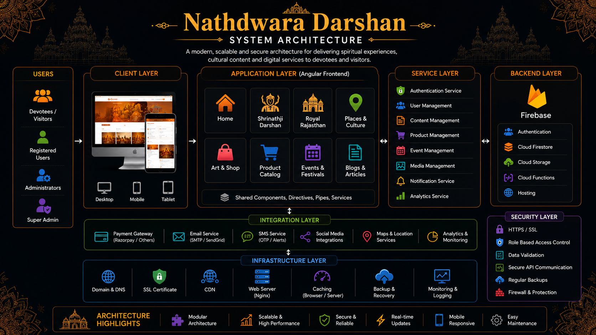

# 🙏 Nathdwara Digital Platform


Modern digital platform for Nathdwara Darshan designed to enhance devotee experiences, streamline daily operations, and provide seamless access to services and information.

<p align="center">
  
</p>

---

## 🌐 Live Platform

https://nathdwaradarshan.com/

---

## Platform Vision

Nathdwara Digital Platform is designed to provide a modern digital experience for devotees while simplifying operational activities through a centralized and easy-to-use platform.

The platform focuses on accessibility, engagement, digital convenience, and operational efficiency, helping users stay connected with daily activities and services.

---

## Platform Highlights

* Modern responsive user experience
* Daily darshan updates
* Digital service management
* User account management
* Online order management
* Notifications & announcements
* Administrative management tools
* Analytics & reporting
* Mobile-friendly experience
* Secure platform infrastructure

---

## User Management System

The platform provides dedicated experiences for different user groups.

### Supported Roles

* Super Admin
* Administrators
* Staff Members
* Registered Users
* Visitors

---

## Digital Experience Infrastructure

### User Experience

The platform provides:

* Personalized user dashboard
* Profile management
* Activity tracking
* Notification center
* Content accessibility
* Responsive mobile experience

---

### Administrative Operations

Administrators can:

* Manage content
* Manage users
* Monitor activities
* Publish announcements
* Manage services
* Review analytics

---

## Enterprise Features

* Responsive platform architecture
* Role-based access management
* Real-time content updates
* Notification system
* Analytics dashboards
* Secure user management
* Mobile-first experience
* Scalable infrastructure
* Administrative controls
* Operational visibility

---

## Technology Stack

### Frontend Engineering

* Angular
* TypeScript
* RxJS
* Angular Router
* Tailwind CSS

### Backend Infrastructure

* Firebase
* Firestore
* Authentication
* Cloud Functions

### Architecture & Operations

* Role-Based Access
* Cloud Infrastructure
* Modular Architecture
* Environment Configuration

---

## 🏗️ System Architecture

<p align="center">
  
</p>

Nathdwara Darshan follows a modular Angular architecture designed to deliver spiritual experiences, cultural exploration, tourism information, digital content, and marketplace features through a unified platform.

### Architecture Layers

- **Client Layer**
  - Desktop
  - Tablet
  - Mobile Devices

- **Application Layer**
  - Home
  - Shrinathji Darshan
  - Royal Rajasthan
  - Art & Shop
  - Product Catalog
  - Events & Festivals
  - Blogs & Articles
  - Gallery & Media

- **Service Layer**
  - Authentication
  - Content Management
  - Event Management
  - Product Management
  - Media Services
  - Analytics

- **Backend Layer**
  - Firebase Authentication
  - Cloud Firestore
  - Cloud Storage
  - Cloud Functions
  - Hosting

- **Integration Layer**
  - Email Services
  - Maps & Location Services
  - Social Media Integrations
  - Analytics & Monitoring

- **Security Layer**
  - HTTPS / SSL
  - Role-Based Access Control
  - Secure API Communication
  - Data Validation
  - Backup & Recovery

---

## Platform Preview

The platform delivers a connected digital experience through modern interfaces, operational tools, administrative controls, and user-centric workflows.

---

## 📸 Platform Screenshots

### 🏠 Home Experience

<p align="center">
  
</p>

### 🙏 Shrinathji Darshan

<p align="center">
  
</p>

### 🏛️ History & Heritage

<p align="center">
  
</p>

### 🎭 Places & Culture

<p align="center">
  
</p>

### 🛍️ Art & Shop Marketplace

<p align="center">
  
</p>

### 📅 Events & Festivals

<p align="center">
  
</p>

### 📰 Blog & Cultural Content

<p align="center">
  
</p>

---

## 🔐 Security Architecture

The platform incorporates modern security controls to ensure secure access and protected operations.

Security capabilities include:

* Role-Based Access Control
* Secure Authentication
* Protected Administrative Access
* Secure Data Handling
* Permission-Based Operations

---

## ⚡ Scalability Engineering

The platform is designed to support growing usage and operational requirements.

Scalability features include:

* Modular architecture
* Cloud infrastructure
* Expandable services
* Optimized performance
* Scalable deployment readiness

---

## Business Problem

Traditional information sharing and service management processes often create accessibility challenges, fragmented communication, and operational inefficiencies.

Users increasingly expect faster access to information, seamless digital experiences, and convenient online services.

---

## Solution

The Nathdwara Digital Platform centralizes digital services, communication, operational workflows, and user engagement into one modern platform.

The solution improves accessibility, simplifies operations, and provides a connected digital experience.

---

## Platform Focus Areas

* Digital Experience
* User Engagement
* Content Management
* Operational Efficiency
* Analytics & Reporting
* Administrative Operations
* Cloud Infrastructure
* Scalable Services

---

## Product Roadmap

### Phase 1

* Core Platform
* User Management
* Administrative Tools
* Digital Services

### Phase 2

* Advanced Analytics
* Enhanced User Experience
* Automated Notifications

### Phase 3

* Mobile Applications
* Advanced Reporting
* Service Expansion

### Phase 4

* Intelligent Recommendations
* Automation Workflows
* Future Platform Enhancements

---

## Deployment Infrastructure

* Cloud Hosting
* Production Environment
* Continuous Deployment
* Secure Infrastructure
* Monitoring & Maintenance

---

## Repository Structure

```txt
assets/
├── architecture/
├── branding/
├── screenshots/
└── workflows/
```

## Engineering Vision

The platform is designed to provide a reliable, scalable, and modern digital experience while maintaining operational simplicity and long-term maintainability.

---

## Why This Platform Exists

The goal is to make digital services more accessible, improve operational efficiency, and create a better connected experience through modern technology.

---

# 📄 License

MIT License

Copyright © 2026 SHIVAM ITCS
